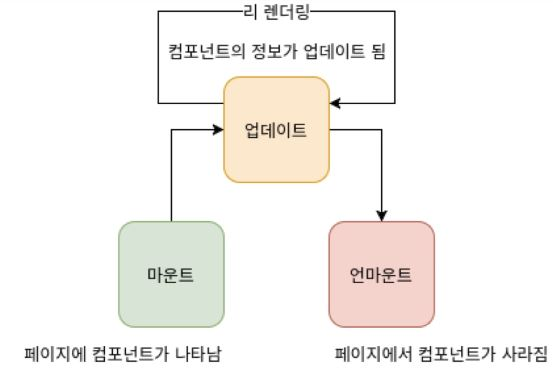

# #1 React 시작하기

> React는 페이스북에서 만든 프론트엔드 라이브러리

## 브라우저의 작동방식

<br/>
[브라우저는 어떻게 동작하는가? 출처: NAVER D2](http://d2.naver.com/helloworld/59361)

1. 브라우저가 html을 전달 받으면, 우선 렌더엔진이 이를 각 html 요소와 관련된 노드로 파싱하여 DOM트리를 만든다.
2. 외부 CSS파일과 각 elements의 인라인 스타일을 파싱해서 스타일 정보를 사용한 렌더트리를 만든다.
3. 렌더트리를 만드는 과정 뒤에서는 노드 스타일을 처리하는 **동기적 과정 (어테치먼트)**가 발생한다. 이 메소드는 스타일정보를 계산해서 객체형태로 반환한다. 렌더트리를 만드는 과정에선 어태치먼트를 통해서 각 요소의 스타일이 계산된다.
4. 그 이후 Reflow, Repaint가 발생한다.<br/>
> 즉, DOM의 변화가 생기면 렌더트리를 재생성하고, 모든 요소의 스타일이 다시 계산되며, 레이아웃을 페인팅하는 과정의 반복이다. 

<br/>

## Virtual DOM
* 복잡한 SPA에서는 DOM조작이 많이 발생할 수 밖에 없다. 그 변화를 적용하기 위해선 브라우저가 많은 연산을 하게되고 성능의 문제가 발생하게 된다. 여기서 바로 **Virtual DOM**이 빛을 발하게 된다.
* 가상의 DOM을 만들고 View의 변화가 생긴다면 실제 DOM에 적용전에 가상 DOM에 먼저 적용을 시키고 최종적인 결과를 실제 DOM으로 전달한다. 그러므로 브라우저 업데이트 빈도가 현저하게 줄어들게 된다.
* React에서는 실제 DOM과 가상 DOM을 비교하는 **Reconciliation(조화) 비교 알고리즘**을 제공한다. 원래 트리비교는 대략 O(n^3)의 비교를 해야하지만 위 알고리즘으로 최적화하여 O(n)의 비교를 가능하게 한다.
  * 전제 #1 : 같은 형태의 엘리먼트들은 비슷한 DOM 트리를 가지고 있다.
  * 전제 #2 : 다른 형태의 엘리먼트는 서로 다른 DOM 트리를 가지고 있다. 다르게 생겼으면 내부를 비교하지 않음. 
  * 배열을 렌더링할 때 : 엘리먼트에 key 값을 설정하여 고유값을 주고, 이를 통해 렌더링시 새로 렌더링하지않고 유지함으로써 성능 최적화. 
> 오해! React가 DOM보다 빠르다?<br/>
이는 잘못된 사실이다. 사실은 유지보수가 용이한 어플리케이션 생산에 도움을 주고, 대부분의 상황에 충분히 빠르게 동작하는것이다.

## Babel
* ES6,7 과 같은 최신화된 자바스크립트 문법을 구형 브라우저에서도 사용할수 있게 변환시켜주는 도구

## Webpack

* js파일을 모듈화 해서 사용하는건 Node.js의 기능이다. 브라우저에는 없지만 브라우저에서 이와 같은 기능을 가능케 도와주는게 Webpack이다. 
* 하나의 파일로 합칠수(bundle) 있고, 분리할 수 있다.

## JSX
* 자바스크립트 확장 문법
* babel의 react 프리셋이 javascript로 변경시켜준다.
* 장점 
  * 보기 쉽고 익숙하다.
  * 에러검사에 용이하다.
  * 더 높은 활용도
* 문법
  * 하나의 엘리먼트안에 감싸져있어야 한다.
  * 자바스크립트 표현을 할 땐 {} 안에 해야함.
  * if문 대신 조건부 연산자를 사용 **ex. 3항 연산자, &&** 
  * 태그 내 property는 camelcase로 작성한다. **ex. background-color => backgroundColor**
  * 태그는 꼭 닫혀야한다.
  * 만약 복잡해진다면 아래와 같이 한다.
```jsx harmony
<div>
    {function(){
        if(10===10)
            return 10;
        
        return 0;
    }()}
</div>
```  

## Component
* React를 사용해서 어플리케이션의 UI를 설계할때 사용자에게 보이는 모든 요소는 Component로 구성되어있다.

#### Props
* React에서 데이터는 단방향 흐름이다. 부모가 자식에게 단방향으로 주는 요소들이 props다.
* 자식내에서 props를 사용할때 최근에는 비구조화할당을 사용한다.
```js
class Example extends Component {
    render() {
        const { prop1, prop2 } = this.props; // props를 비구조화 할당 시키는 코드. this.props를 참조하여 const prop1, const prop2 를 만든다.
        
        return (
            <div>
                <p>hello, {prop1}!</p>
                <p>bye, {prop2}!</p>
            </div>
        )
    }
}
```

* 기본값 설정하기 `defaultProps`
```js
class Example extends Component {
    static defaultProps = { //defaultProps 설정하는 ES7 문법 
        prop1 : 'default1',
        prop2 : 'default2'  
    }
    
    render() {
        const { prop1, prop2 } = this.props;
        
        return (
            <div>
                <p>hello, {prop1}!</p>
                <p>bye, {prop2}!</p>
            </div>
        )
    }
}
```
* props 검증하기 `propTypes`
  * array: 배열
  * bool: t/f
  * func: 함수
  * number: 숫자
  * object: 객체
  * string: 문자열
  * element: div 태그, 리액트 컴포넌트 등
  * node: 렌더링 될 수 있는 모든 것
  * ondOf([배열]): 배열 내부의 값들
  * any: 모든 것
```js
import PropTypes from 'prop-types'; // 따로 import 해와야 한다.

class Example extends Component {
    static defaultProps = { 
        prop1 : 'default1',
        prop2 : 'default2'  
    }
    
    static propTypes = { // propTypes 검증
        prop1: PropTypes.string,
        prop2: PropTypes.string.isRequired // 꼭 있어야함을 명시
    }
    
    render() {
        const { prop1, prop2 } = this.props;
        
        return (
            <div>
                <p>hello, {prop1}!</p>
                <p>bye, {prop2}!</p>
            </div>
        )
    }
}
```
> 모든 컴포넌트마다 propTypes를 지정해주는것이 좋은 습관이다. 협업할때는 더더욱 필요하다.

#### State
* 컴포넌트 고유의 것.
```js
class Example extends Component {
    state = {
        example: 400
    }
    
    render() {
        const { example } = this.state;
        
        return (
            <div>
                <p>state, {example}!</p>
            </div>
        )
    }
}
```
* state의 값 변경은 언제나 this.setState({...})를 통해서 변경시켜야 함.
  * `setState()` 함수를 실행해야만 리렌더링을 트리거한다. 
  * `setState()`시 state 내부의 변경값만 바꾸고 나머진 유지된다. 하지만 state 내부에 객체가 있다면 달라진다.
```js
class SetStateTest extends Component {
    state = {
        testingObj: {
            name : 'son',
            number: 1
        }
    }
    
    handleClick = () => {
        this.setState({
            testingObj: {
                number: 5
            }
        })
    }
    
    // 위의 handleClick 실행시 testingObj의 number만 5로 바뀌는것이 아니라 testingObj 자체가 변경되어 name이 사라지게 된다.
    // 이를 방지하기 위해 spread operator를 사용한다.
    
    handleClick = () =>{
        this.setState({
            testingObj: {
                ...this.state.testingObj, // spread operator
                number: 5
            }
        })
    }
}
```
#### Arrow Function
* ES6의 문법으로 기존의 function()과 유사하다. 하지만 this 스코프에서 차이가 발생한다.
```js
class ArrowTest extends Component {
    originalFuncTest() {
        console.log('what is', this); 
    }
    
    arrowFuncTest = () => {
        console.log('what is', this);
    }
    
    render() {
        const {originalFuncTest, arrowFuncTest} = this;
        
        return (
            <div>
                <button onClick={originalFuncTest}>original</button> // 클릭시 this 가 안나옴. 
                <button onClick={arrowFuncTest}>arrow</button> 
            </div>
        )
    }
}
```

#### Event
* 이벤트 이름은 camel-case
* !!함수형태의 객체를 전달 (실행하는 구조가 되면 안된다.)
  *  ~~onClick={handleEvent()}~~
  * onClick={handleEvent}
* DOM 요소에만 event를 지정할 수 있다.
* 이벤트 종류
  * Clipboard
  * Composition
  * Keyboard
  * Focus
  * Form
  * Mouse
  * Selection
  * Touch
  * UI
  * Wheel
  * Media
  * Image
  * Animation
  * Transition
  * [Facebook Official Documents](https://facebook.github.io/react/docs/events.html)

#### ref
* DOM에 직접 접근할때 사용한다.
```jsx harmony
<div ref={ref=>this.refTest=ref}>ref!</div>


this.refTest //접근할 땐 이와 같이 접근한다. ex. this.refTest.focus();
```

#### LifeCycle Method

* 마운트 : 컴포넌트가 페이지에 나타남. (되기 전 후로 메소드 2개)
  1. constructor(props) : 가장 처음 실행되는 생성자 메소드, 주로 state를 정의함.
      ```js
      constructor(props) {
          super(props);
      }
      ```
  2. **componentWillMount()**  
        * Dom이 나타나기 전에 실행되는 메소드
        * 한번만 실행되며. `this.props`, `this.state` 사용 불가능.
        * `setState()` 사용가능, DOM에 접근 불가능.
        * 서버사이드에서 실행 가능.
  3. render() : 렌더링 메소드로써 컴포넌트의 모양새를 정의해 준다.
  4. **componentDidMount()** 
        * 첫 렌더링 후 실행되는 메소드
        * 다른 자바스크립트 라이브러리나 프레임워크 함수 호출 가능
        * *이벤트 등록 / setTimeout / 네트워크 요청 / 비동기 작업은 여기서 실행함*
        * DOM에 접근 가능
* 업데이트 : 컴포넌트의 정보가 업데이트. (되기 전 후로 메소드 4개)
  1. **componentWillRecieveProps(nextProps)**
        * 부모에게서 새로 props를 받게 될 때 실행.
        * props 값에 따라 state에 변화를 줘야 할 때 여기서 작업.
        * `setState()`실행 가능하고, 새 props는 nextProps 파라미터를 통해 접근이 가능하다. 
  2. **shouldComponentUpdate(nextProps, nextState)**
        * props나 state가 변경되면 이 메소드를 실행함.
        * `true` / `false` 를 반환함 (default 로 `true` 를 반환함.)
        * 컴포넌트를 최적화할때 중요한 역할을 함.(Virtual DOM에 불필요한 re-rendering작업을 중단시킴)
  3. **componentWillUpdate(nextProps, nextState)** 
        * `shouldComponentUpdate()`가 `true`를 반환했을 때 실행.
        * 업데이트를 실행하기 전 실행
        * DOM 조작 및 `setState()`를 하면 정상적으로 작동되지 않음.
  4. render()
  5. **componentDidUpdate(prevProps, prevState)**
        * re-rendering을 마친 후 실행.
        * DOM 관련 처리 가능
        * `prevProps`, `prevState`를 통해 이전 데이터에 접근이 가능.
* 언마운트 : 페이지에서 컴포넌트 사라짐 (되기 전 메소드 1개) 
  1. **componentWillUnmount()** 
        * 컴포넌트가 DOM에서 제거될 때 실행.
        * 여기서 타이머 / 이벤트 등을 제거함.
