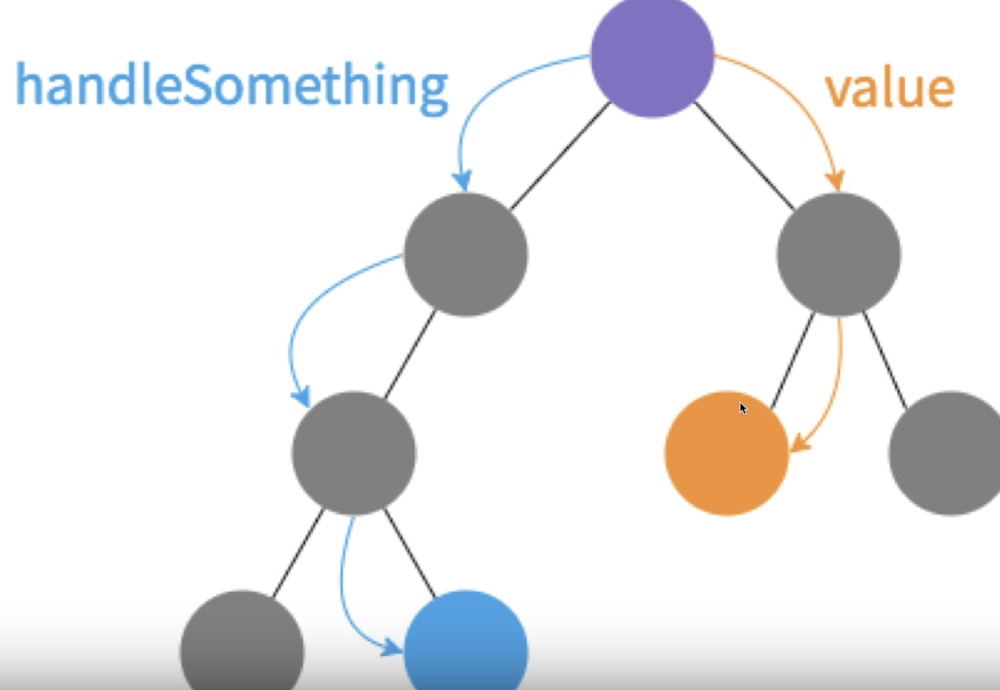
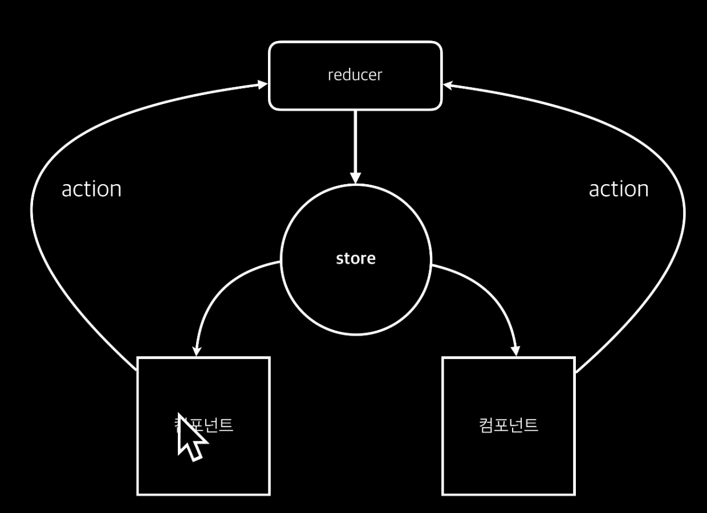
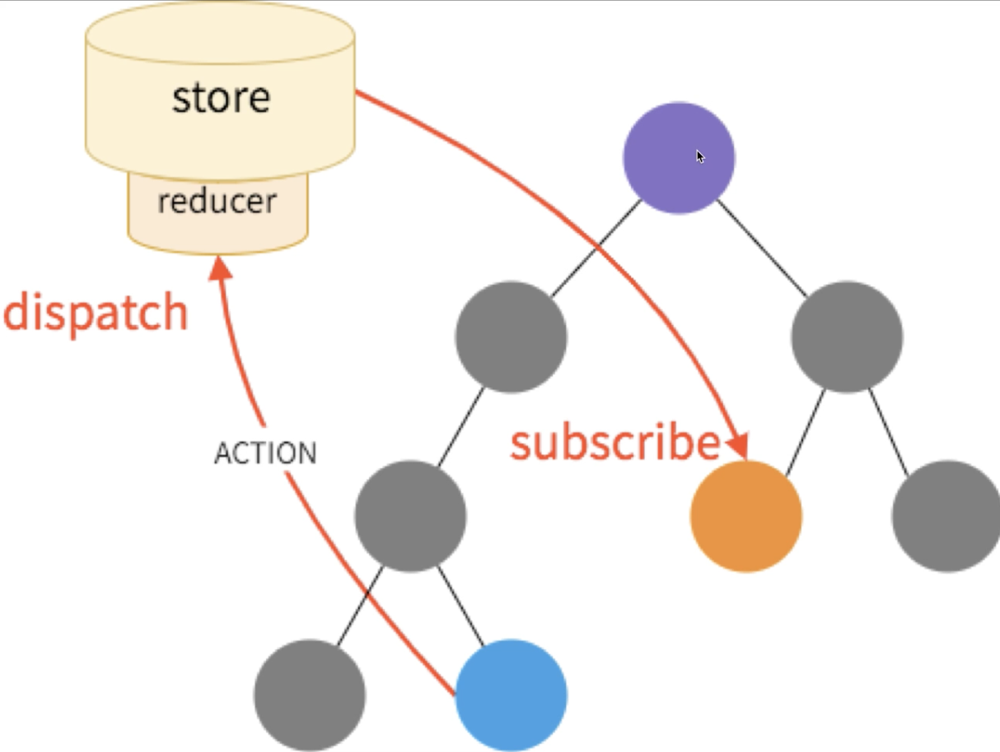

# #3 Redux
> 상태 관리 라이브러리

## Redux는 왜 쓰는가?
앱의 규모가 커질수록 state 관리가 힘들어진다.
* 복잡한 상태를 관리하기 위해서.
* 리덕스를 사용하면 렌더링 낭비를 해결할 수 있다.

## 구조


앞서 진행했던 프로젝트들의 구조다. 
만약 value를 주황색으로 전달하려면 부모 노드를 거쳐서 전달해야했다.
파란색에게 handleSomething을 전달하려면 부모 노드를 거쳐 전달해야했었다.

redux를 사용하면 구조가 좀 바뀐다.
프로젝트의 상태를 모두 담고 있는 `store`가 있다. .

필요한 정보를 컴포넌트에게 props로 전달한다.
그러다 어떤 변화가 일어났다, 예를들어 input의 텍스트 정보가 바뀌거나 모달이 열렸다 닫혔다. 하면 액션을 reducer에게 전달한다.

reducer은 변화를 일으켜주는 함수이다.

action은 객체이다. (액션의 종류와 정보가 담긴)

액션 객체를 reducer란 함수에 넣어주면 다음 state를 리턴한다.

리듀서는 여러개가 될 수 있다. (inputReducer, modalReducer 등등 )
마지막엔 리듀서를 하나로 합쳐준다 (루트리듀서)


예를들어 모달을 닫는 액션이 들어왔다고 가정하면
1. 컴포넌트가 액션을 리듀서에세 디스패치한다 
2. 루트리듀서가 서브리듀서에게 너네중에 모달 처리할수 있는 리듀서가 있는지 확인한다.
3. 서브리듀서중 처리할 수 있는 리듀서가 다음 스테이트를 리턴한다.
4. 처리할 수 없는 리듀서도 원래의 값을 리턴한다.
5. 루트리듀서는 상태들을 통합해서 새로운 스테이트를 스토어에 반영한다.

> 업데이트의 전체적인 흐름은 컴포넌트에서 setState가 아니라 업데이트에 대한 정보를 가지고 있는 action이라는 객체를 만들어서 리듀서에게 전달해주고, 리듀서는 새로운 스테이트를 스토어에 반영한다.

여기서 중요한 부분은 컴포넌트 내에서 상태변화가 일어났었는데 이제 컴포넌트 바깥으로 이동했다.

## 구성 요소

* 스토어 : 어플리케이션의 상태 값들을 내장하고 있음
* 액션 : 상태 변화를 일으킬 때 참조하는 객체
* 디스패치 : 액션을 리듀서에 전달하는것이 디스패치
* 리듀서 : 상태를 변화시키는 로직이 있는 함수, 초기상태가 정해져야 한다.
* 구독 : 스토어의 값을 필요로 하는 컴포넌트는 스토어를 구독함.



예전과는 달리 컴포넌트 밖에서 상태변화가 일어난다.


### Redux를 꼭 사용해야 할까? 컴포넌트의 state는 사용하지 말아야 하나?
만약 redux를 사용하지 않고 충분히 개발가능하면 사용하지않아도 된다.
ui에 종속적인 정보라면 굳이 redux store에 관리할 필요가 없음. 내부에서만 사용되고 자주 사용된다면 그냥 state에서 관리하는게 더 나음.
값을 여러 컴포넌트에서 공유할때는 스토어에 저장하는게 낫다.

> 참고, redux는 react와 궁합이 잘 맞는 라이브러리는 맞지만, 리덕스는 리액트와는 별개다.

## Redux의 3가지 원칙
1. 스토어는 단 1개
  * 스토어 객체 안에는 상태값이 있고, 디스패치, 구독같은 내장함수도 스토어에 들어가있다.
  * 단 1개인데 그 안에 어플리케이션의 모든 상태가 들어가있다.
  * 상태 객체의 구조를 어떻게 할지는 개발자마다 다름.
2. State는 읽기 전용이다. (여기서 말하는 state는 스토어 내의 상태)
  * 직접 수정하면 안된다.
3. 변화는 순수 함수로 이뤄져야한다
  * 똑같은 상태에 똑같은 값이 주어지면 항상 같은 결과가 나와야한다.
  * random이나 date같은 결과값이 달라질수있는 값이 있으면 안된다.
  * 파라미터로 받은 애들을 직접 수정하면 안된다.
  * 네트워크 요청도 하면 안된다.

## Store의 API
> 리덕스작업을하면서 스토어 api를 직접사용할일은 많지않다. react-redux에서 잘 추상화해줘서 쉽게 사용할수있다.

* getState() : 현재 상태를 가져옴
* subscribe(listener)
  * 상태구독, listener는 함수다. 상태가 변화할 때 마다 listener함수가 실행하게 된다.
  * 리턴값은 unsubscribe()
* dispatch(action)
  * 액션 보내기

## Presentational & Container 컴포넌트

Presentational Component
* 멍청한 컴포넌트
* DOM과 style을 가지고 있다.
* 내부에 프레젠테이셔널 / 컨테이너 컴포넌트들을 가지고 있을 수 없다.
* store에 직접적인 연결이 없다.
* props로만 데이터를 가져온다.
* state를 가지고 있지 않다. (있는 경우 UI 관련)
* 주로 함수형, state가 필요하거나 LifeCycle이 필요할때 클래스형

Container Component
* 똑똑한 컴포넌트
* DOM 엘리먼트가 직접적으로 사용되지 않음, 있다면 감싸는 용도로만
* 스타일을 가지고 있지 않음
* 프레젠테이셔널 컴포넌트와 컨테이너 컴포넌트들을 관리
  * 리덕스와 연동하여 상태를 가져오고 자식들에게 넣어준다.
* 리덕스와 연동이 되어 있음

### 장점 
* UI와 데이터 관리의 분리
* 이해하기 쉬운 프로젝트 구조
* 높아지는 컴포넌트 재사용률

### 컨테이너 컴포넌트 대상?
* 페이지
* 리스트
* 헤더
* 사이드바
* 내부의 컴포넌트 때문에 props가 여러 컴포넌트를 거쳐야하는 경우

### 오해하기 쉬운 부분
* 컨테이너 컴포넌트라고해서 무조건 내부에 여러개의 컴포넌트가 있을 필요가 없다.
* 어떤걸 컨테이너로 할 지, 그리고 구조를 따를지는 자유
* 무조건 따라야 할 규칙이 아니다.

## action
액션은 `src/actions/ActionTypes.js`에 정의해둔다
```ecmascript 6
export const INCREMENT = 'INCREMENT';
export const DECREMENT = 'DECREMENT';
export const SET_COLOR = 'SET_COLOR';
```
이렇게 정의해둔다.
나중에 이 값들은 한꺼번에 불러올때 
`import * as types from '주소'`
이렇게 불러 올 수 있다.
액션 타입을 만드는 이유는 액션 타입을 액션 생성 함수쪽에서도 참조하고, 리듀서에서도 참조하기 때문에, 그리고 리듀서와 액션생성함수는 분리되어 있기 때문에 동시에 사용하기 위해 만든것.

## reducer

### 리듀서 함수
state와 action을 파라미터로 가지는 함수
switch 문을 통하여 action.type에 따라 상태의 변화를 일으킴
상태를 직접 수정하지말고, 기존 state값에 새 값을 덮어씌운 새 객체를 만들어야 함.

### 리듀서 합치기
서브 리듀서를 하나로 합치는건 combineReducers 함수를 사용한다.
```ecmascript 6
import {combineReducers} from 'redux';
import subReducer1 from '...';
import subReducer2 from '...';

const reducers = combineReducers({
    prop1: subReducer1,
    prop2: subReducer2
});

export default reducers;
```
combineReducers를 실행하고 나면 나중에 store의 형태가 파라미터로 전달한 객체의 모양대로 만들어진다.
```ecmascript 6
store = {
    prop1: {
        subReducer1Data: something
    },
    prop2: {
        subReducer2Data: somethingElse
    }
}
```

## Connect

컨테이너 컴포넌트를 만들땐 connect를 사용해서 만든다.
상태와 액션함수를 리덕스로 연결시키고, 컴포넌트의 props로 연결해준다.
커넥트를 사용할때 커넥트는 두가지의 파라미터를 받는다
1. mapStateToProps
2. mapDispatchToProps

```ecmascript 6
connect(mapStateToProps, mapDispatchToProps);

```
실행하면 함수가 반환되는데, 이 함수에 컴포넌트를 파라미터로 넣어서 실행시켜주면 해당 컴포넌트에 지정된 props를 전달해준다.
```ecmascript 6
connect(...)(MyComponent);
```

## Immutable.js
왜쓰는가? 
객체의 불변성을 지키기 위해서 사용함.
리액트에서 `state`혹은 `props`가 변할 때 리랜더링을 함
객체/배열을 직접적으로 수정하면, 레퍼런스가 가르키는곳이 같기 때문에 똑같은 값으로 인식한다. 리액트 입장에선 상태가 바뀐지 모른다. 업데이트를 하지 않는다.
그러므로 새 객체/배열을 생성하는 방법으로 상태를 업데이트한다.

근데, 새 객체/배열을 생성하려면, 간단한 작업이 복잡해진다.
```ecmascript 6
let object1 = {
    a: 1,
    b: 2,
    c: 3, 
    d: {
        e: 4,
        f: {
            g: 5,
            h: 6
        }
    }
};
// 만약 h값을 10으로 바꾸고 싶다면 ??
let object2 = {
    ...object1,
    d: {
        ...object1.d,
        f: {
            ...object1.d.f,
            h: 10
        }
    }
};
```
단순히 h값을 10으로 바꾸고싶을뿐인데 위 코드처럼 엄청 귀찮아진다.

이런 귀찮음을 줄여주는 도구가 바로 Immutable.js. **심지어 속도도 더 빠르다**

### Map()
객체 대신 사용되는 구조
객체를 만들 때 사용하는 함수 

```ecmascript 6
let object1 = Map({
    a: 1,
    b: 2,
    c: 3, 
    d: Map({
        e: 4,
        f: Map({
            g: 5,
            h: 6
        })
    })
});

let object2 = object1.setIn(['d','f','h'], 10);
```


### List()
배열을 만들 때 사용하는 함수 
배열과 동일한 함수가 있음 (`map`, `sort`, `pop`, `push`)
차이점은 언제나 새로운 배열을 생성함
```ecmascript 6
const {Map, List} = Immutable;

let list = List([0,1,2,3,4,5]);

list.get(1) // 1번째 아이템 겟
list.get(0) // 0번째 아이템 겟

let list2 = List([
    Map({
        number: 1,
        color: 'black'
    }),
    Map({
        number: 2,
        color: 'green'
    }),
    Map({
        number: 0,
        color: 'blue'
    }),
]);

//만약 리스트 1번짜 아이템의 number를 변경하고 싶다면
let newList = list2.setIn([1, 'number'], 50);

let newList = list2.setIn([1, 'number'], list2.get(1, 'number') + 1);
// 업데이트를 사용하는 방법도 있다
list2.update(1, (item) => item.set('number', item.get('number') + 1));

// 제거시
list2.remove(1);

// 마지막 제거시
list2.pop();

// 모든 작업은 원본 리스트를 바꾸지 않고 새로운 객체를 생성 및 반환한다!
```

### fromJS()
객체/배열을 Map, List로 알아서 변환시켜줌. 

## Ducks
액션 하나 추가할 때 마다 액션 타입에, 액션 생성자에, 리듀서에..
3가지 파일을 수정해야한다. 상당히 귀찮다.

이 문제를 해결하기 위한 솔루션이 바로 Ducks다.

### Ducks 의 구조
리듀서, 액션타입, 액션생성자를 한 파일에 넣고, 이를 모듈 이라고 부른다.
```ecmascript 6
// Actions
const CREATE = 'goci/widgets/CREATE';
const UPDATE = 'goci/widgets/UPDATE';
const DELETE = 'goci/widgets/DELETE';

// Reducers
export default function reducer(state= {}, action = {}){
    switch (action.type) {
        //todo reducer function
        default: return state;
    }
}

// Action Creators
export function createWidgets(widget) {
    return {type: CREATE, widget}
}

export function updateWidget(widget) {
    return {type: UPDATE, widget}
}

export function deleteWidget(widget) {
    return {type: DELETE, widget}
}
```

위는 예시 모듈이다.

### 규칙
* npm-module-or-app/reducer/ACTION_TYPE 의 형태
* 모듈을 만드는게 아니라면 맨 앞은 생략하여 reducer/ACTION_TYPE 도 가능
* 리듀서를 만들땐 export default로 내보내기
* 액션 생성자는 export 로 내보내기

### redux-actions
redux-actions 를 활용하면 액션관리가 더욱 편해진다.
* createAction
  * 액션 생성자 만드는걸 자동화
  * 그저 파라미터를 넣을 뿐인데 굳이 함수를 하나하나 만들어야 하나? 자동화 하면 어떨까? => createAction!
  ```ecmascript 6
  export const increment = (index) => ({
    type: types.INCREMENT,
    index
  });
  // 이런 코드가 createAction을 사용하면
  export const increment = createAction(types.INCREMENT); 
  // 그렇다면 index는 어디로 갔는가?
  ```
  * 액션 생성자는 최대 1개의 파라미터를 받는 것으로 가정한다. 그 파라미터를 payload 라고 한다. 
  ```ecmascript 6
  increment(3);
  // 위와 같이 increment에 파라미터 3을 넣어서 실행하면 아래와 같이 생성된다.
  /* 결과
  {
    type: 'INCREMENT',
    payload: 3  
  };
  */
  
  // 여러개를 전달해야 한다면 객체를 전달한다
  increment({index:5, color: 'black'});
  /* 결과
  {
    type: 'INCREMENT',
    payload: {
      index: 5,
      color: 'black'
    }
  }
  */
  ```
* handleActions
  * 리듀서 작성하는걸 switch case 말고 객체를 통해 작성, 스코프를 나눔. 
  * 스코프를 공유하는 switch case의 단점 극복
  ```ecmascript 6
  const reducer = handleActions({
    INCREMENT: (state, action) => ({
      counter: state.counter + action.payload
    }),
  
    DECREMENT: (state, action) => ({
      counter: state.counter - action.payload
    })
  }, { counter: 0});
  // 첫번 째 파라미터 : 액션이름: 함수 로 이루어진 객체
  // 두번 째 파라미터 : 기본 상태 
  ```
